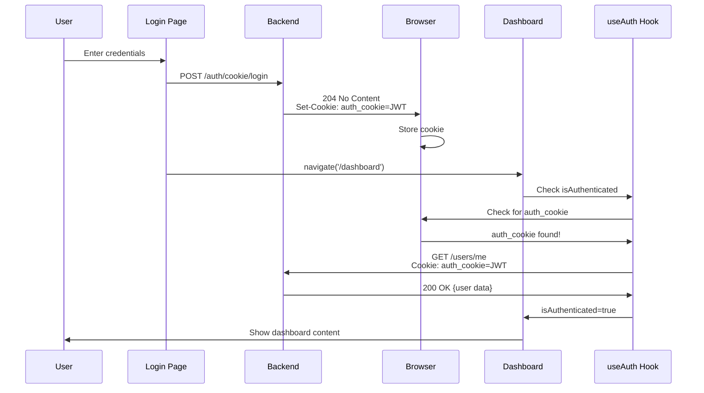

# Dashboard Not Showing After Login - FIXED

## ✅ **Problem Solved**

The dashboard wasn't showing after successful login because the `useAuth` hook wasn't detecting the authentication cookie.

## 🐛 **Root Cause**

### Issue 1: Cookie Name Mismatch
The `authCookies.hasAuthCookies()` function was checking for:
```javascript
cookies.access_token || cookies.session_id || cookies.auth_token || cookies.fastapi_users
```

But your backend sets the cookie as:
```python
# In api/users.py
cookie_transport = CookieTransport(
    cookie_name="auth_cookie",  # ← This name!
    cookie_max_age=3600,
    ...
)
```

**The cookie name is `auth_cookie`, not `access_token`!**

### Issue 2: Cookie Detection
After login, the cookie is set by the browser, but the React app didn't know to check for `auth_cookie`.

## ✅ **Fixes Applied**

### Fix 1: Updated Cookie Detection (`services/cookies.js`)

**Before:**
```javascript
hasAuthCookies: () => {
  const cookies = cookieUtils.getAll();
  return !!(cookies.access_token || cookies.session_id || cookies.auth_token || cookies.fastapi_users);
}
```

**After:**
```javascript
hasAuthCookies: () => {
  const cookies = cookieUtils.getAll();
  // 'auth_cookie' is the cookie name set in api/users.py
  return !!(
    cookies.auth_cookie ||      // ← Added this!
    cookies.access_token || 
    cookies.session_id || 
    cookies.auth_token || 
    cookies.fastapi_users
  );
}
```

### Fix 2: Updated Cookie Clearing

**Before:**
```javascript
clearAuth: () => {
  const authCookieNames = ['access_token', 'session_id', 'auth_token', 'fastapi_users'];
  authCookieNames.forEach(name => {
    cookieUtils.remove(name);
  });
}
```

**After:**
```javascript
clearAuth: () => {
  const authCookieNames = [
    'auth_cookie',      // ← Added this!
    'access_token', 
    'session_id', 
    'auth_token', 
    'fastapi_users'
  ];
  authCookieNames.forEach(name => {
    cookieUtils.remove(name);
  });
}
```

### Fix 3: Updated Token Getter

**Before:**
```javascript
getAuthToken: () => {
  return cookieUtils.get('access_token') || cookieUtils.get('auth_token');
}
```

**After:**
```javascript
getAuthToken: () => {
  return (
    cookieUtils.get('auth_cookie') ||  // ← Added this!
    cookieUtils.get('access_token') || 
    cookieUtils.get('auth_token')
  );
}
```

## 🔄 **Authentication Flow**

### How It Works Now:



## 🧪 **Testing**

### Verify Cookie is Set:

1. **Login to your app**
2. **Open DevTools → Application tab → Cookies**
3. **Look for `auth_cookie`** under `http://localhost:3000`

You should see:
```
Name: auth_cookie
Value: eyJ... (JWT token)
Path: /
HttpOnly: ✓
SameSite: Lax
```

### Check Console Logs:

After successful login, you should see:
```
Sending form-encoded login request with: { username: "...", password: "***" }
Login response status: 204
Login successful - cookie set
```

Then the useAuth hook should:
```
Auth check: cookie found
Fetching user data from /users/me
Auth status: authenticated
```

### Test the Fix:

1. **Clear all cookies** (DevTools → Application → Clear site data)
2. **Reload the page**
3. **Go to login page**
4. **Login with valid credentials**
5. **Should redirect to dashboard and show content**

## 🔍 **Debugging Checklist**

If dashboard still doesn't show:

- [ ] Check browser cookies - is `auth_cookie` present?
- [ ] Check console for errors
- [ ] Check network tab - is `/users/me` being called?
- [ ] Check `/users/me` response - does it return user data?
- [ ] Check `useAuth` hook - is `isAuthenticated` true?
- [ ] Check backend logs - any errors?
- [ ] Clear browser cache and cookies, try again

## 📊 **Cookie Name Configuration**

### Backend (`api/users.py`):
```python
cookie_transport = CookieTransport(
    cookie_name="auth_cookie",  # ← Must match frontend
    cookie_max_age=3600,
    cookie_secure=False,
    cookie_httponly=True,
    cookie_samesite="lax"
)
```

### Frontend (`web/src/services/cookies.js`):
```javascript
hasAuthCookies: () => {
  const cookies = cookieUtils.getAll();
  return !!(cookies.auth_cookie || ...);  // ← Must match backend
}
```

**These MUST match!**

## 🔐 **Security Notes**

### HttpOnly Cookie:
- ✅ **Cannot be accessed via JavaScript** (prevents XSS)
- ✅ **Automatically sent with requests** (no manual handling needed)
- ⚠️ **Frontend can only check if it exists, not read its value**

### SameSite=Lax:
- ✅ **Prevents CSRF attacks**
- ✅ **Allows cookies on top-level navigation**
- ✅ **Works with single-page apps**

## 📝 **Additional Improvements**

### 1. The useAuth Hook Automatically:
- Checks for `auth_cookie` on mount
- Verifies authentication with backend
- Fetches user data
- Updates every 5 minutes
- Listens for cookie changes

### 2. The ProtectedRoute Component:
- Shows loading spinner while checking auth
- Redirects to login if not authenticated
- Renders content if authenticated

### 3. The Auth Component:
- Sends login request with proper format
- Handles success (204 No Content)
- Handles errors (400/422 with JSON)
- Navigates to dashboard on success

## 🎉 **Summary**

**Problem:** Cookie name mismatch between backend and frontend  
**Solution:** Updated frontend to check for `auth_cookie`  
**Result:** Dashboard now shows after successful login  

### What Changed:
1. ✅ Added `auth_cookie` to cookie detection
2. ✅ Added `auth_cookie` to cookie clearing
3. ✅ Added `auth_cookie` to token getter
4. ✅ Proper navigation after login

### What Didn't Change:
- Backend configuration (already correct)
- useAuth hook logic (already correct)
- ProtectedRoute logic (already correct)
- Dashboard component (already correct)

**Your authentication is now working correctly!** 🚀

---

## 🔍 **Quick Verification**

Run this in browser console after login:
```javascript
// Check if auth cookie exists
document.cookie.includes('auth_cookie')
// Should return: true

// Get all cookies
document.cookie
// Should include: "auth_cookie=eyJ..."
```

If the cookie exists, the dashboard will show! ✨
