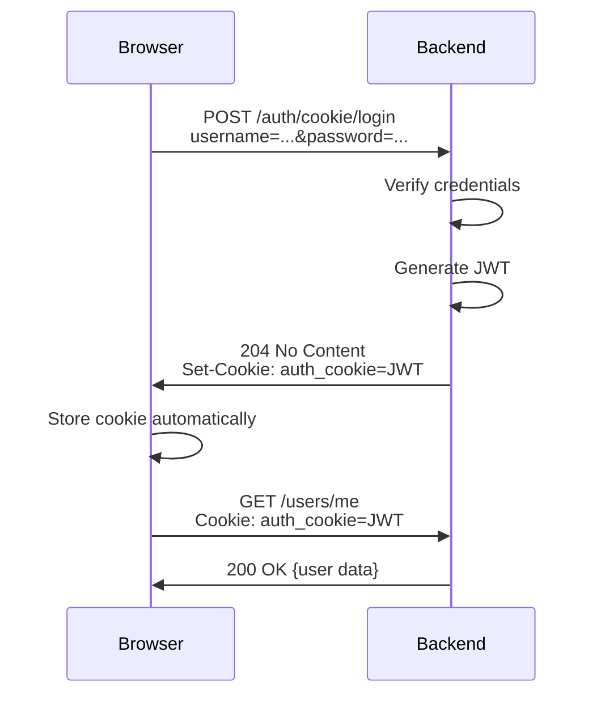
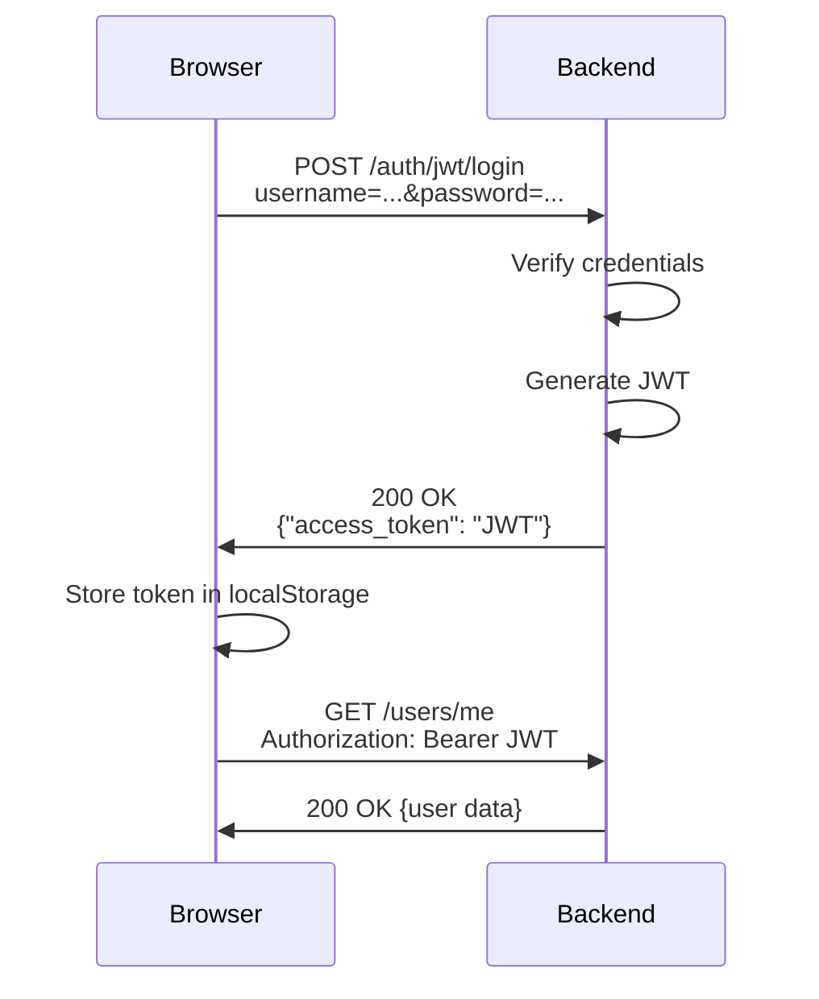

# FastAPI Users Cookie Login Behavior

## ⚠️ **Important: Cookie Login Returns 204 No Content**

### 🐛 **The Issue**

When using `fastapi-users` with `CookieTransport`, the login endpoint returns:
- **Success:** `204 No Content` (empty response body)
- **Error:** `400/422` with JSON error details

If you try to parse a 204 response as JSON, you'll get:
```
SyntaxError: Unexpected end of JSON input
```

### ✅ **The Solution**

**Don't try to parse JSON on successful login!**

```javascript
if (response.ok) {
  // ✅ DON'T call response.json() - there's no body!
  console.log('Login successful - cookie set');
  navigate('/dashboard');
} else {
  // ✅ Only parse JSON on error responses
  const errorData = await response.json();
}
```

## 📊 **Response Comparison**

### Cookie Login vs JWT Login

| Aspect | Cookie Login | JWT Login |
|--------|--------------|-----------|
| Endpoint | `/auth/cookie/login` | `/auth/jwt/login` |
| Success Status | `204 No Content` | `200 OK` |
| Success Body | **(empty)** | `{"access_token": "...", "token_type": "bearer"}` |
| Auth Storage | **Cookie** (automatic) | **Token** (manual storage) |
| Subsequent Requests | Cookie sent automatically | Must add `Authorization` header |

### Why the Difference?

**Cookie Login:**
- Authentication token is in the `Set-Cookie` header
- No need for response body
- Returns `204 No Content` (standard HTTP for successful action with no content)

**JWT Login:**
- Token must be returned in response body
- Client must store token manually
- Returns `200 OK` with JSON body

## 🔍 **Actual HTTP Responses**

### Successful Cookie Login:
```http
HTTP/1.1 204 No Content
Set-Cookie: auth_cookie=eyJ...; Path=/; HttpOnly; SameSite=lax
Content-Length: 0
```
**Note:** No response body!

### Failed Cookie Login:
```http
HTTP/1.1 400 Bad Request
Content-Type: application/json

{
  "detail": "LOGIN_BAD_CREDENTIALS"
}
```

### Successful JWT Login:
```http
HTTP/1.1 200 OK
Content-Type: application/json

{
  "access_token": "eyJ...",
  "token_type": "bearer"
}
```

## ✅ **Correct Implementation**

### Cookie Login (No JSON parsing on success):
```javascript
const response = await fetch('http://localhost:9000/auth/cookie/login', {
  method: 'POST',
  headers: {
    'accept': 'application/json',
    'Content-Type': 'application/x-www-form-urlencoded',
  },
  credentials: 'include',
  body: formBody.toString(),
});

if (response.ok) {
  // ✅ Success: Cookie is set, no body to parse
  console.log('Login successful - cookie set');
  navigate('/dashboard');
} else {
  // ⚠️ Error: Parse JSON error details
  const errorData = await response.json();
  console.error('Login failed:', errorData.detail);
}
```

### Safe JSON Parsing (with error handling):
```javascript
if (response.ok) {
  // Success - no JSON to parse
  navigate('/dashboard');
} else {
  // Check if response has JSON content
  const contentType = response.headers.get('content-type');
  let errorData = { detail: 'Login failed' };
  
  if (contentType && contentType.includes('application/json')) {
    try {
      errorData = await response.json();
    } catch (e) {
      console.error('Failed to parse error response:', e);
    }
  }
  
  // Handle error...
}
```

## ❌ **Wrong Implementation**

### DON'T Parse JSON on Success:
```javascript
if (response.ok) {
  const data = await response.json(); // ❌ Error! 204 has no body
  navigate('/dashboard');
}
```

### DON'T Parse JSON Without Checking:
```javascript
const data = await response.json(); // ❌ Fails if response is 204
```

## 🔐 **Authentication Flow**

### Cookie Login:


### JWT Login:


## 🧪 **Testing**

### Test Cookie Login with cURL:
```bash
# Successful login
curl -X POST http://localhost:9000/auth/cookie/login \
  -H "Content-Type: application/x-www-form-urlencoded" \
  -d "username=test@example.com&password=testpassword123" \
  -v

# Look for:
# < HTTP/1.1 204 No Content
# < Set-Cookie: auth_cookie=eyJ...
# (no response body)
```

### Test JWT Login with cURL:
```bash
# Successful login
curl -X POST http://localhost:9000/auth/jwt/login \
  -H "Content-Type: application/x-www-form-urlencoded" \
  -d "username=test@example.com&password=testpassword123"

# Returns:
# {"access_token":"eyJ...","token_type":"bearer"}
```

## 📋 **Status Code Reference**

| Status | Meaning | Response Body | When |
|--------|---------|---------------|------|
| 200 OK | Success with content | ✅ Has JSON | JWT login success |
| 204 No Content | Success, no content | ❌ Empty | Cookie login success |
| 400 Bad Request | Client error | ✅ Has JSON | Invalid credentials |
| 422 Unprocessable Entity | Validation error | ✅ Has JSON | Missing fields |
| 500 Internal Server Error | Server error | ✅ May have JSON | Server problem |

## 🎯 **Best Practices**

### 1. **Check Status Before Parsing:**
```javascript
if (response.ok) {
  // Handle success (may or may not have body)
} else {
  // Parse error response
}
```

### 2. **Check Content-Type:**
```javascript
const contentType = response.headers.get('content-type');
if (contentType && contentType.includes('application/json')) {
  const data = await response.json();
}
```

### 3. **Use Try-Catch for JSON Parsing:**
```javascript
try {
  const data = await response.json();
} catch (e) {
  console.error('Not a JSON response:', e);
}
```

### 4. **Check Status Code:**
```javascript
if (response.status === 204) {
  // No content - don't try to parse
} else if (response.ok) {
  const data = await response.json();
}
```

## 🐛 **Common Errors**

### Error 1: "Unexpected end of JSON input"
**Cause:** Trying to parse empty 204 response  
**Fix:** Don't parse JSON on successful cookie login

### Error 2: "response.json() is not a function"
**Cause:** Response was already consumed  
**Fix:** Only call `response.json()` once

### Error 3: Cookie not being sent
**Cause:** Missing `credentials: 'include'`  
**Fix:** Add `credentials: 'include'` to fetch options

### Error 4: CORS error with cookies
**Cause:** Backend not configured for credentials  
**Fix:** Set `allow_credentials=True` in CORS middleware

## ✅ **Final Implementation**

```javascript
const handleLogin = async (formData) => {
  try {
    const formBody = new URLSearchParams();
    formBody.append('username', formData.email);
    formBody.append('password', formData.password);

    const response = await fetch('http://localhost:9000/auth/cookie/login', {
      method: 'POST',
      headers: {
        'accept': 'application/json',
        'Content-Type': 'application/x-www-form-urlencoded',
      },
      credentials: 'include',
      body: formBody.toString(),
    });

    if (response.ok) {
      // ✅ Success: Cookie is set in response headers
      // Don't try to parse JSON - 204 has no body!
      console.log('Login successful - cookie set');
      navigate('/dashboard');
    } else {
      // ⚠️ Error: Parse JSON error details
      const contentType = response.headers.get('content-type');
      let errorData = { detail: 'Login failed' };
      
      if (contentType && contentType.includes('application/json')) {
        try {
          errorData = await response.json();
        } catch (e) {
          console.error('Failed to parse error response:', e);
        }
      }
      
      console.log('Login error:', errorData);
      setError(errorData.detail || 'Login failed');
    }
  } catch (error) {
    console.error('Network error:', error);
    setError('Network error. Please try again.');
  }
};
```

## 🎉 **Summary**

Key points to remember:

✅ **Cookie login returns 204 No Content** - no body to parse  
✅ **JWT login returns 200 OK with JSON** - parse the body  
✅ **Always check `response.ok` before parsing**  
✅ **Check content-type before calling `.json()`**  
✅ **Use try-catch when parsing JSON**  
✅ **Don't parse the same response twice**  

**Your implementation is now correct and won't crash on successful login!** 🚀
