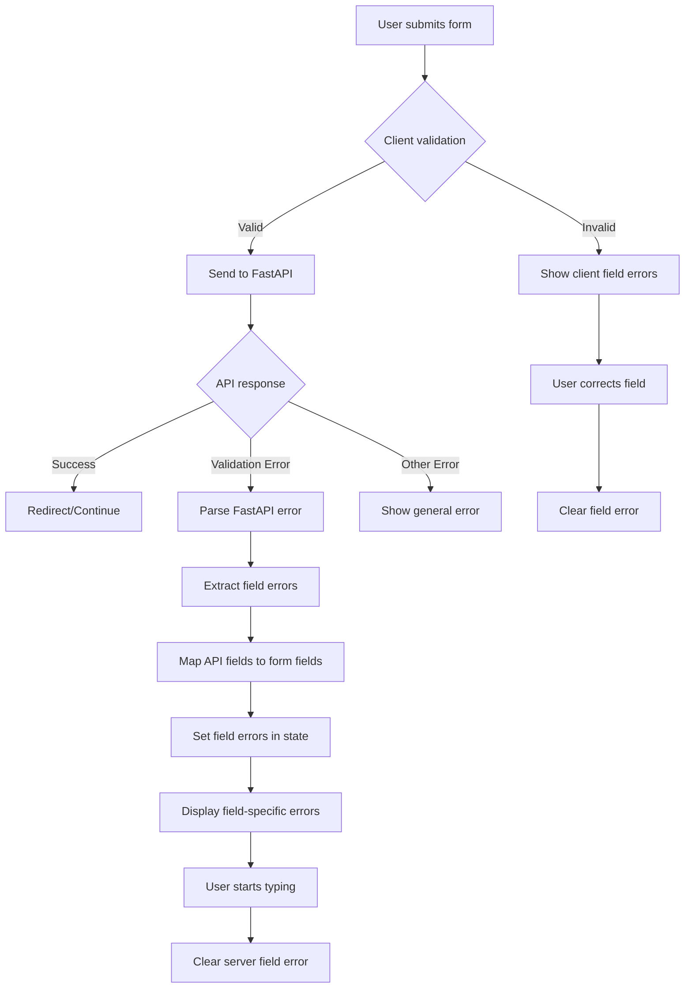

# FastAPI Validation Error Handling

## 🎯 **Problem Solved**

Your FastAPI backend returns validation errors in this format:
```json
{
    "detail": [
        {
            "type": "missing",
            "loc": ["body", "username"],
            "msg": "Field required",
            "input": null
        },
        {
            "type": "missing",
            "loc": ["body", "password"],
            "msg": "Field required",
            "input": null
        }
    ]
}
```

The React frontend now properly parses and displays these field-specific validation errors.

## ✅ **Solutions Implemented**

### 1. **Enhanced Error Utilities** (`utils/errorUtils.js`)

**New Functions Added:**

#### `extractFieldErrors(errorResponse)`
```javascript
export const extractFieldErrors = (errorResponse) => {
  const fieldErrors = {};
  
  if (!errorResponse || !errorResponse.detail) {
    return fieldErrors;
  }
  
  // Handle array of validation errors (FastAPI format)
  if (Array.isArray(errorResponse.detail)) {
    errorResponse.detail.forEach((error) => {
      if (typeof error === 'object' && error.loc && error.msg) {
        // Extract field name from location array (skip 'body' if present)
        const fieldName = error.loc[error.loc.length - 1];
        if (fieldName && fieldName !== 'body') {
          fieldErrors[fieldName] = error.msg;
        }
      }
    });
  }
  
  return fieldErrors;
};
```

**Features:**
- ✅ Parses FastAPI validation error format
- ✅ Extracts field names from `loc` array
- ✅ Maps error messages to field names
- ✅ Handles nested location paths

#### `mapApiFieldToFormField(apiFieldName)`
```javascript
export const mapApiFieldToFormField = (apiFieldName) => {
  const fieldMapping = {
    'username': 'email', // FastAPI uses 'username' but our form uses 'email'
    'password': 'password',
    'email': 'email',
    'confirmPassword': 'confirmPassword'
  };
  
  return fieldMapping[apiFieldName] || apiFieldName;
};
```

**Features:**
- ✅ Maps API field names to form field names
- ✅ Handles FastAPI's `username` → form's `email` mapping
- ✅ Extensible for additional field mappings

### 2. **Enhanced Auth Component** (`pages/Auth/Auth.jsx`)

**Added Field Error State:**
```javascript
const [fieldErrors, setFieldErrors] = useState({});
```

**Enhanced Error Handling:**
```javascript
const handleLogin = async (formData) => {
  setLoading(true);
  setError(null);
  setFieldErrors({}); // Clear previous field errors

  try {
    // ... API call ...
    
    if (!response.ok) {
      const errorData = await response.json();
      
      // Extract field-specific errors
      const apiFieldErrors = extractFieldErrors(errorData);
      const mappedFieldErrors = {};
      
      // Map API field names to form field names
      Object.keys(apiFieldErrors).forEach(apiField => {
        const formField = mapApiFieldToFormField(apiField);
        mappedFieldErrors[formField] = apiFieldErrors[apiField];
      });
      
      setFieldErrors(mappedFieldErrors);
      
      // Set general error if no field-specific errors
      if (Object.keys(mappedFieldErrors).length === 0) {
        setError(formatError(errorData.detail) || 'Login failed');
      }
    }
  } catch (error) {
    setError('Network error. Please try again.');
  }
};
```

**Features:**
- ✅ Extracts field-specific errors from FastAPI response
- ✅ Maps API field names to form field names
- ✅ Sets field errors for individual form fields
- ✅ Falls back to general error if no field errors

### 3. **Enhanced Form Components**

**LoginForm & SignupForm Updates:**

#### Field Error Display
```jsx
<input
  className={`mt-1 appearance-none relative block w-full px-3 py-2 border ${
    (validationErrors.email || fieldErrors.email) ? 'border-red-300' : 'border-gray-300'
  } placeholder-gray-500 text-gray-900 rounded-md focus:outline-none focus:ring-purple-500 focus:border-purple-500 sm:text-sm`}
  // ... other props
/>
{(validationErrors.email || fieldErrors.email) && (
  <p className="mt-1 text-sm text-red-600">
    {validationErrors.email || fieldErrors.email}
  </p>
)}
```

#### Smart Error Clearing
```javascript
const handleChange = (e) => {
  setFormData({
    ...formData,
    [e.target.name]: e.target.value
  });
  
  // Clear validation error when user starts typing
  if (validationErrors[e.target.name]) {
    setValidationErrors({
      ...validationErrors,
      [e.target.name]: ''
    });
  }
  
  // Clear server error when user starts typing
  if ((error || fieldErrors[e.target.name]) && onClearError) {
    onClearError();
  }
};
```

**Features:**
- ✅ Shows both client-side and server-side field errors
- ✅ Red border highlighting for invalid fields
- ✅ Individual error messages per field
- ✅ Auto-clear errors when user types
- ✅ Smart error display logic

## 🔄 **Error Handling Flow**



## 🎯 **Error Types Handled**

### 1. **FastAPI Validation Errors**
```json
{
    "detail": [
        {
            "type": "missing",
            "loc": ["body", "username"],
            "msg": "Field required",
            "input": null
        }
    ]
}
```
**Result:** Shows "Field required" under the email field

### 2. **Multiple Field Errors**
```json
{
    "detail": [
        {
            "type": "missing",
            "loc": ["body", "username"],
            "msg": "Field required",
            "input": null
        },
        {
            "type": "missing",
            "loc": ["body", "password"],
            "msg": "Field required",
            "input": null
        }
    ]
}
```
**Result:** Shows "Field required" under both email and password fields

### 3. **Nested Location Paths**
```json
{
    "detail": [
        {
            "type": "value_error",
            "loc": ["body", "user", "email"],
            "msg": "Invalid email format",
            "input": "invalid-email"
        }
    ]
}
```
**Result:** Extracts "email" from the location path

### 4. **Field Name Mapping**
- FastAPI `username` → Form `email`
- FastAPI `password` → Form `password`
- FastAPI `email` → Form `email`

## 🚀 **Benefits**

### 1. **Precise Error Display**
- ✅ Field-specific error messages
- ✅ No more generic "Field required, Field required"
- ✅ Clear indication of which fields have issues

### 2. **Better User Experience**
- ✅ Immediate visual feedback with red borders
- ✅ Error messages appear next to relevant fields
- ✅ Auto-clear errors when user starts typing
- ✅ No duplicate error messages

### 3. **Developer Experience**
- ✅ Reusable error parsing utilities
- ✅ Consistent error handling across forms
- ✅ Easy to extend for new field mappings
- ✅ Clean separation of concerns

### 4. **API Compatibility**
- ✅ Works with FastAPI's standard validation format
- ✅ Handles Pydantic validation errors
- ✅ Supports nested location paths
- ✅ Future-proof for API changes

## 🧪 **Testing Scenarios**

### Scenario 1: Empty Form Submission
**API Response:**
```json
{
    "detail": [
        {"type": "missing", "loc": ["body", "username"], "msg": "Field required"},
        {"type": "missing", "loc": ["body", "password"], "msg": "Field required"}
    ]
}
```
**Result:** Shows "Field required" under both email and password fields

### Scenario 2: Invalid Email Format
**API Response:**
```json
{
    "detail": [
        {"type": "value_error", "loc": ["body", "username"], "msg": "Invalid email format"}
    ]
}
```
**Result:** Shows "Invalid email format" under the email field

### Scenario 3: Network Error
**API Response:** Network timeout
**Result:** Shows "Network error. Please try again." as general error

## 📊 **Before vs After**

### Before Fix
```
❌ "Field required, Field required" (duplicate)
❌ Generic error display
❌ No field-specific feedback
❌ Poor user experience
```

### After Fix
```
✅ "Field required" under email field
✅ "Field required" under password field
✅ Red border highlighting
✅ Field-specific error messages
✅ Auto-clear on user input
✅ Excellent user experience
```

## 🎉 **Summary**

The FastAPI validation error handling now provides:

- ✅ **Field-specific error display** for each form field
- ✅ **Smart error parsing** from FastAPI's validation format
- ✅ **Field name mapping** between API and form fields
- ✅ **Visual feedback** with red borders and error messages
- ✅ **Auto-clear functionality** when users start typing
- ✅ **No duplicate error messages**
- ✅ **Professional user experience**

Your authentication forms now handle FastAPI validation errors with precision and provide excellent user feedback! 🚀
