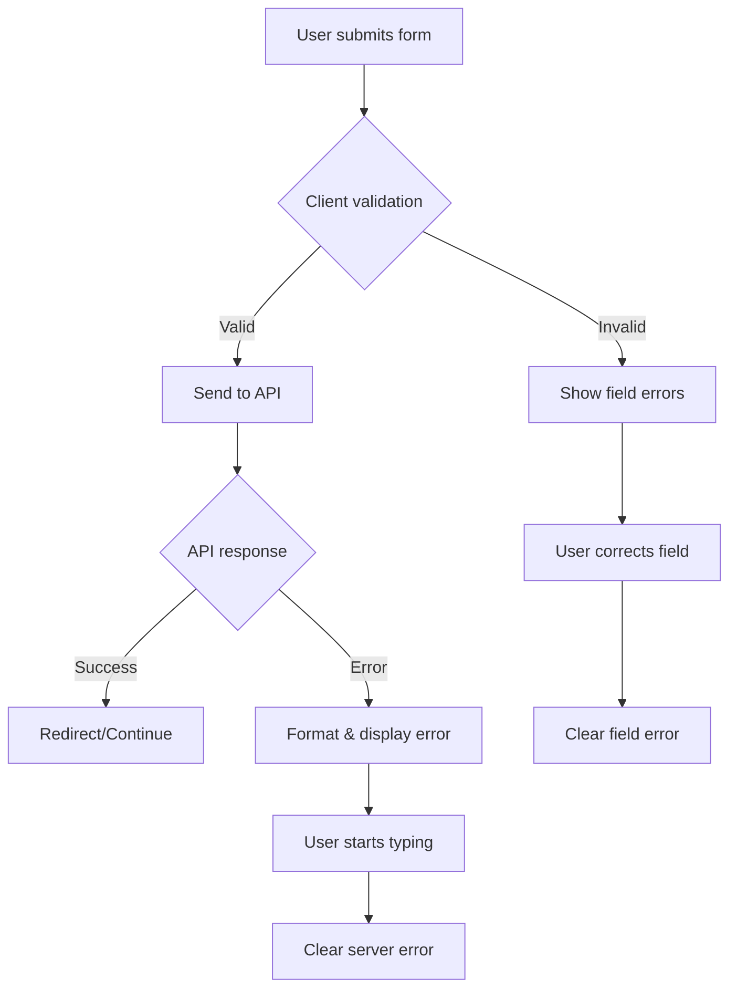

# Field Validation Improvements

## 🐛 **Problem Solved**

The "Field required, Field required" error was occurring because:

1. **Duplicate Error Messages**: The API was returning an array of validation errors like `[{msg: "Field required"}, {msg: "Field required"}]`, which our error formatter was joining with commas.

2. **No Client-Side Validation**: Forms were sending empty fields to the API, causing unnecessary server-side validation errors.

3. **Poor User Experience**: Users had to submit forms to see validation errors.

## ✅ **Solutions Implemented**

### 1. **Enhanced Error Formatting** (`utils/errorUtils.js`)

**Before:**
```javascript
// Would show: "Field required, Field required"
error.map(err => err.msg).join(', ')
```

**After:**
```javascript
// Now shows: "Field required" (removes duplicates)
const uniqueMessages = [...new Set(errorMessages.filter(msg => msg && msg.trim()))];
if (uniqueMessages.length === 1) {
  return uniqueMessages[0]; // Show single message if all are the same
}
```

**Features:**
- ✅ Removes duplicate error messages
- ✅ Filters out empty messages
- ✅ Shows single message when all errors are identical
- ✅ Joins different messages with commas

### 2. **Client-Side Validation** (`LoginForm.jsx` & `SignupForm.jsx`)

**Added comprehensive validation:**

```javascript
const validateForm = () => {
  const errors = {};
  
  // Email validation
  if (!formData.email.trim()) {
    errors.email = 'Email is required';
  } else if (!/\S+@\S+\.\S+/.test(formData.email)) {
    errors.email = 'Please enter a valid email address';
  }
  
  // Password validation
  if (!formData.password) {
    errors.password = 'Password is required';
  }
  
  setValidationErrors(errors);
  return Object.keys(errors).length === 0;
};
```

**Benefits:**
- ✅ Prevents API calls with empty fields
- ✅ Immediate feedback to users
- ✅ Better user experience
- ✅ Reduces server load

### 3. **Improved Form UI**

**Enhanced input styling:**
```jsx
<input
  className={`mt-1 appearance-none relative block w-full px-3 py-2 border ${
    validationErrors.email ? 'border-red-300' : 'border-gray-300'
  } placeholder-gray-500 text-gray-900 rounded-md focus:outline-none focus:ring-purple-500 focus:border-purple-500 sm:text-sm`}
/>
```

**Individual field error display:**
```jsx
{validationErrors.email && (
  <p className="mt-1 text-sm text-red-600">{validationErrors.email}</p>
)}
```

**Features:**
- ✅ Red border for invalid fields
- ✅ Individual error messages per field
- ✅ Clear visual feedback
- ✅ Better accessibility with labels

### 4. **Smart Error Display Logic**

**Server errors only show when no client validation errors:**
```jsx
{error && !Object.values(validationErrors).some(err => err) && (
  <div className="rounded-md bg-red-50 p-4">
    {/* Server error display */}
  </div>
)}
```

**Auto-clear errors when user types:**
```javascript
const handleChange = (e) => {
  // Clear validation error when user starts typing
  if (validationErrors[e.target.name]) {
    setValidationErrors({
      ...validationErrors,
      [e.target.name]: ''
    });
  }
  // Clear server error when user starts typing
  if (error && onClearError) {
    onClearError();
  }
};
```

## 🎯 **User Experience Improvements**

### Before Fix
```
❌ User submits empty form
❌ API returns: "Field required, Field required"
❌ Poor error display
❌ No immediate feedback
```

### After Fix
```
✅ User sees validation errors immediately
✅ Clear, individual field errors
✅ No duplicate messages
✅ Smart error clearing
✅ Better visual feedback
```

## 🔧 **Files Modified**

1. **`utils/errorUtils.js`** - Enhanced error formatting
2. **`pages/Auth/components/LoginForm.jsx`** - Added client-side validation
3. **`pages/Auth/components/SignupForm.jsx`** - Added client-side validation
4. **`pages/Auth/Auth.jsx`** - Added error clearing functionality

## 🧪 **Validation Rules**

### LoginForm
- **Email**: Required, valid email format
- **Password**: Required

### SignupForm
- **Email**: Required, valid email format
- **Password**: Required, minimum 6 characters
- **Confirm Password**: Required, must match password

## 🚀 **Benefits**

### 1. **Better User Experience**
- ✅ Immediate validation feedback
- ✅ Clear, non-duplicate error messages
- ✅ Visual field highlighting
- ✅ Smart error clearing

### 2. **Reduced Server Load**
- ✅ Client-side validation prevents unnecessary API calls
- ✅ Only valid data reaches the server
- ✅ Faster form submission

### 3. **Improved Accessibility**
- ✅ Proper labels for screen readers
- ✅ Clear error associations
- ✅ Better keyboard navigation

### 4. **Developer Experience**
- ✅ Reusable validation logic
- ✅ Consistent error handling
- ✅ Easy to maintain and extend

## 📊 **Error Handling Flow**



## 🎉 **Summary**

The field validation improvements provide:

- ✅ **No more duplicate error messages**
- ✅ **Immediate client-side validation**
- ✅ **Better visual feedback**
- ✅ **Improved user experience**
- ✅ **Reduced server load**
- ✅ **Enhanced accessibility**

Your authentication forms now provide a smooth, professional user experience with clear validation feedback! 🚀
