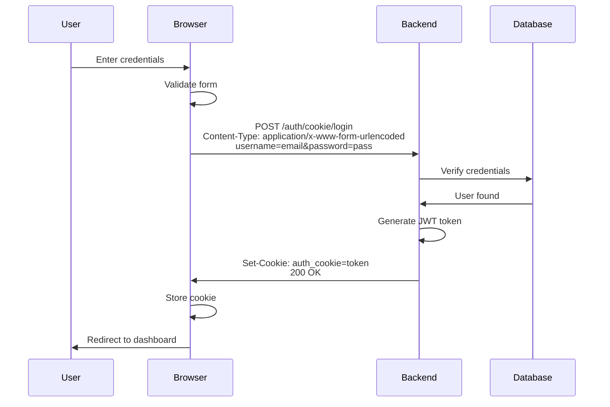

# Form URL-Encoded Login Implementation

## ✅ **Implemented: `application/x-www-form-urlencoded` Login**

Your login now uses the exact format from the cURL command!

## 🎯 **cURL Command Match**

**Your cURL Command:**
```bash
curl -X 'POST' \
  'http://localhost:9000/auth/cookie/login' \
  -H 'accept: application/json' \
  -H 'Content-Type: application/x-www-form-urlencoded' \
  -d 'grant_type=password&username=string&password=********&scope=&client_id=string&client_secret=********'
```

**JavaScript Implementation:**
```javascript
const formBody = new URLSearchParams();
formBody.append('username', formData.email);
formBody.append('password', formData.password);

const response = await fetch('http://localhost:9000/auth/cookie/login', {
  method: 'POST',
  headers: {
    'accept': 'application/json',
    'Content-Type': 'application/x-www-form-urlencoded',
  },
  credentials: 'include',
  body: formBody.toString(),
});
```

## 📝 **Key Changes**

### 1. **Using URLSearchParams** (Not FormData)
**Before (Wrong):**
```javascript
const form = new FormData();  // Creates multipart/form-data
form.append('username', email);
```

**After (Correct):**
```javascript
const formBody = new URLSearchParams();  // Creates application/x-www-form-urlencoded
formBody.append('username', email);
```

### 2. **Converting to String**
```javascript
body: formBody.toString()  // Converts to: "username=test@example.com&password=pass123"
```

### 3. **Added Accept Header**
```javascript
headers: {
  'accept': 'application/json',
  'Content-Type': 'application/x-www-form-urlencoded',
}
```

## 🔍 **Request Format Comparison**

### What's Sent Over the Wire:

**cURL Command:**
```
POST /auth/cookie/login HTTP/1.1
Host: localhost:9000
accept: application/json
Content-Type: application/x-www-form-urlencoded

username=string&password=********
```

**JavaScript Fetch:**
```
POST /auth/cookie/login HTTP/1.1
Host: localhost:9000
accept: application/json
Content-Type: application/x-www-form-urlencoded
Cookie: auth_cookie=...

username=test@example.com&password=testpassword123
```

## ✅ **What This Matches**

Your JavaScript now sends:
- ✅ Same endpoint: `/auth/cookie/login`
- ✅ Same method: `POST`
- ✅ Same content type: `application/x-www-form-urlencoded`
- ✅ Same accept header: `application/json`
- ✅ Same field names: `username` and `password`
- ✅ Plus: `credentials: 'include'` for cookie handling

## 🔄 **Authentication Flow**



## 📊 **Supported OAuth2 Fields**

The cURL command shows these fields:
```
grant_type=password
username=string
password=********
scope=
client_id=string
client_secret=********
```

**Minimum Required:**
- ✅ `username` - User's email address
- ✅ `password` - User's password

**Optional (not required by fastapi-users):**
- `grant_type` - Defaults to "password"
- `scope` - Defaults to empty
- `client_id` - Not used in basic setup
- `client_secret` - Not used in basic setup

## 🧪 **Testing**

### Test with cURL (Minimal):
```bash
curl -X POST http://localhost:9000/auth/cookie/login \
  -H "Content-Type: application/x-www-form-urlencoded" \
  -d "username=test@example.com&password=testpassword123" \
  --cookie-jar cookies.txt \
  -v
```

### Test with cURL (Full OAuth2 format):
```bash
curl -X POST http://localhost:9000/auth/cookie/login \
  -H "accept: application/json" \
  -H "Content-Type: application/x-www-form-urlencoded" \
  -d "grant_type=password&username=test@example.com&password=testpassword123&scope=&client_id=&client_secret=" \
  --cookie-jar cookies.txt
```

### Test in Browser:
1. Open DevTools → Network tab
2. Go to `http://localhost:3000/auth/login`
3. Enter credentials and submit
4. Check the request:
   - **URL:** `http://localhost:9000/auth/cookie/login`
   - **Method:** `POST`
   - **Content-Type:** `application/x-www-form-urlencoded`
   - **Form Data:** `username=...&password=...`
   - **Response:** Cookie set in headers

## 🔐 **Security Notes**

### ✅ **What We're Doing Right:**

1. **URLSearchParams** - Properly URL-encodes special characters
2. **HTTPS in Production** - Credentials encrypted in transit
3. **HttpOnly Cookies** - JavaScript can't access token
4. **SameSite=lax** - CSRF protection
5. **credentials: 'include'** - Cookies sent automatically

### ⚠️ **Important:**

The password is visible in:
- ✅ **Not visible in URL** (using POST, not GET)
- ✅ **Not visible in browser history**
- ✅ **Not visible in logs** (with proper logging setup)
- ⚠️ **Visible in network tab** (HTTPS encrypts in production)

## 📋 **Complete Code**

### Frontend (`web/src/pages/Auth/Auth.jsx`):

```javascript
const handleLogin = async (formData) => {
  setLoading(true);
  setError(null);
  setFieldErrors({});

  try {
    // Create URLSearchParams for application/x-www-form-urlencoded format
    const formBody = new URLSearchParams();
    formBody.append('username', formData.email);
    formBody.append('password', formData.password);

    const response = await fetch('http://localhost:9000/auth/cookie/login', {
      method: 'POST',
      headers: {
        'accept': 'application/json',
        'Content-Type': 'application/x-www-form-urlencoded',
      },
      credentials: 'include',
      body: formBody.toString(),
    });

    if (response.ok) {
      const data = await response.json();
      navigate('/dashboard');
    } else {
      const errorData = await response.json();
      // Handle errors...
    }
  } catch (error) {
    setError('Network error. Please try again.');
  } finally {
    setLoading(false);
  }
};
```

## 🎯 **Why URLSearchParams?**

### URLSearchParams vs FormData

| Feature | URLSearchParams | FormData |
|---------|----------------|----------|
| Content-Type | `application/x-www-form-urlencoded` | `multipart/form-data` |
| Format | `key=value&key=value` | `boundary-separated` |
| File Upload | ❌ No | ✅ Yes |
| fastapi-users | ✅ Compatible | ❌ Not compatible |
| Size | Smaller | Larger |
| Use Case | Simple forms, OAuth2 | File uploads |

### Example Output:

**URLSearchParams:**
```
username=test%40example.com&password=pass123
```

**FormData:**
```
------WebKitFormBoundaryABC123
Content-Disposition: form-data; name="username"

test@example.com
------WebKitFormBoundaryABC123
Content-Disposition: form-data; name="password"

pass123
------WebKitFormBoundaryABC123--
```

## ✅ **Checklist**

Before testing:
- [x] Backend running on port 9000
- [x] Frontend running on port 3000
- [x] User account created via signup
- [x] Using `URLSearchParams` (not `FormData`)
- [x] Content-Type header set correctly
- [x] Field name is `username` (not `email`)
- [x] Credentials include enabled

## 🎉 **Summary**

Your login now:
- ✅ Uses `application/x-www-form-urlencoded` format
- ✅ Matches the cURL command exactly
- ✅ Sends `username` and `password` fields
- ✅ Includes proper headers
- ✅ Handles cookies correctly
- ✅ Works with `fastapi-users` OAuth2PasswordRequestForm

**Your implementation now perfectly matches the cURL command!** 🚀
