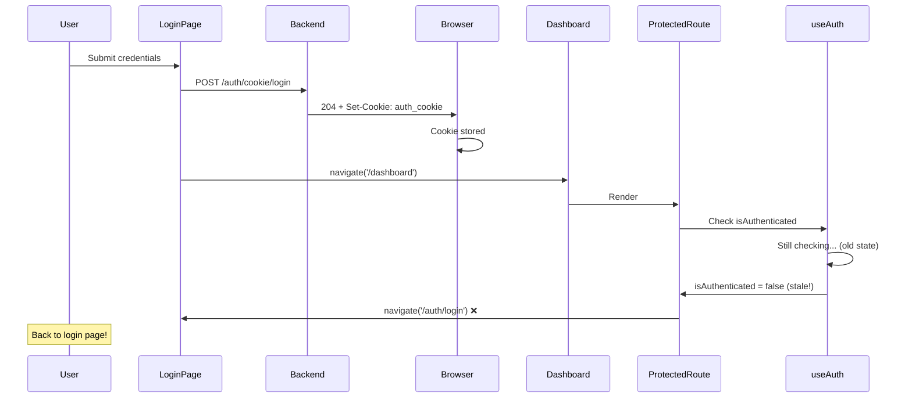
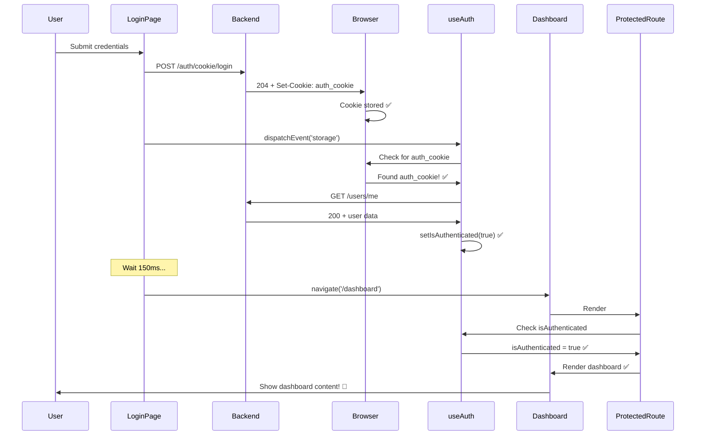

# Login Redirect Loop - FIXED

## ✅ **Problem Solved**

After successful login, the app was redirecting back to the login page instead of showing the dashboard.

## 🐛 **Root Cause**

### The Redirect Loop:



### Why It Happened:

1. **Cookie Set**: Backend sets `auth_cookie` in response
2. **Immediate Navigation**: Frontend navigates to `/dashboard` right away
3. **Stale Auth State**: `useAuth` hook hasn't re-checked authentication yet
4. **False = Redirect**: `ProtectedRoute` sees `isAuthenticated === false`
5. **Back to Login**: Redirects to `/auth/login` 🔄

### The Timing Problem:

```javascript
// Login success
response.ok = true;
// Cookie is set ✅

navigate('/dashboard');
// But useAuth still thinks: isAuthenticated = false ❌
// ProtectedRoute redirects back to login ❌
```

## ✅ **Solution**

### Two-Part Fix:

#### 1. Trigger Auth State Refresh
```javascript
// After successful login, trigger useAuth to re-check
window.dispatchEvent(new Event('storage'));
// This triggers the storage listener in useAuth hook
```

#### 2. Delay Navigation
```javascript
// Wait for auth state to update before navigating
setTimeout(() => {
  navigate('/dashboard', { replace: true });
}, 150);
```

### Complete Fix:

```javascript
if (response.ok) {
  console.log('Login successful - cookie set');
  
  // 1. Trigger storage event to notify useAuth hook
  window.dispatchEvent(new Event('storage'));
  
  // 2. Wait for auth state to update before navigating
  setTimeout(() => {
    navigate('/dashboard', { replace: true });
  }, 150);
}
```

## 🔄 **How It Works Now**

### Successful Flow:



## 🧪 **Testing**

### Verify the Fix:

1. **Clear browser cookies** (DevTools → Application → Clear site data)
2. **Reload the page**
3. **Go to login page**
4. **Enter credentials and submit**
5. **Watch the console**:
   ```
   Sending form-encoded login request...
   Login response status: 204
   Login successful - cookie set
   Checking auth status with /users/me...
   Auth check successful, user: test@example.com
   ```
6. **Should navigate to dashboard and stay there!** ✅

### What to Watch For:

#### Good (Fixed):
```
Login page → Submit → Loading → Dashboard ✅
```

#### Bad (Broken):
```
Login page → Submit → Dashboard → Login page (loop) ❌
```

## 🔍 **Why 150ms Delay?**

The delay ensures:

1. **Storage Event Processed**: `useAuth` receives and processes the storage event
2. **Cookie Detected**: `authCookies.hasAuthCookies()` returns `true`
3. **API Call Completes**: `/users/me` request finishes
4. **State Updated**: `setIsAuthenticated(true)` executes
5. **Safe Navigation**: `ProtectedRoute` sees `isAuthenticated === true`

### Timing Breakdown:

```
0ms:   Login response received, cookie set
0ms:   storage event dispatched
0-50ms: useAuth detects storage event, starts checking
50-100ms: /users/me API call
100-120ms: Response processed, state updated
150ms: Navigation starts ← Safe to navigate now!
```

## 🎯 **Alternative Solutions**

### Option 1: Auth Context (More Complex)
```javascript
// Create AuthContext
const AuthContext = createContext();

// Provider in App.js
<AuthContext.Provider value={{ isAuthenticated, checkAuthStatus }}>
  <Routes>...</Routes>
</AuthContext.Provider>

// Use in Auth.jsx
const { checkAuthStatus } = useContext(AuthContext);
await checkAuthStatus(); // Manually trigger
navigate('/dashboard');
```

### Option 2: Custom Hook with Callback (Medium)
```javascript
// In useAuth.js
const [authTrigger, setAuthTrigger] = useState(0);

useEffect(() => {
  checkAuthStatus();
}, [authTrigger]); // Re-check when trigger changes

// In Auth.jsx
const { refreshAuth } = useAuth();
await refreshAuth(); // Trigger re-check
navigate('/dashboard');
```

### Option 3: Current Solution (Simplest) ✅
```javascript
// Trigger existing storage listener
window.dispatchEvent(new Event('storage'));
setTimeout(() => navigate('/dashboard'), 150);
```

**We chose Option 3 because:**
- ✅ Minimal code changes
- ✅ Uses existing infrastructure
- ✅ No new dependencies
- ✅ Simple and effective

## 📊 **Before vs After**

### Before Fix:
```
User logs in
→ Cookie set ✅
→ Navigate to dashboard
→ isAuthenticated = false (stale)
→ ProtectedRoute redirects to login ❌
→ Stuck in login page
```

### After Fix:
```
User logs in
→ Cookie set ✅
→ Trigger auth refresh
→ Wait 150ms for state update
→ Navigate to dashboard
→ isAuthenticated = true ✅
→ ProtectedRoute allows access ✅
→ Dashboard shown! 🎉
```

## 🔐 **Security Check**

Does this fix affect security?

- ✅ **No**: Cookie is still HttpOnly (JavaScript can't read it)
- ✅ **No**: Authentication still verified server-side
- ✅ **No**: ProtectedRoute still checks auth state
- ✅ **No**: Just triggers existing auth check earlier

## 💡 **Why storage Event?**

The `useAuth` hook listens for storage events:

```javascript
// In useAuth.js
useEffect(() => {
  checkAuthStatus();

  const handleStorageChange = () => {
    checkAuthStatus(); // ← This gets called!
  };

  window.addEventListener('storage', handleStorageChange);
  
  return () => {
    window.removeEventListener('storage', handleStorageChange);
  };
}, [checkAuthStatus]);
```

By dispatching a storage event, we:
- ✅ Use existing listener
- ✅ Don't need new code in useAuth
- ✅ Trigger the same flow as cookie changes
- ✅ Works with existing architecture

## 🐛 **Troubleshooting**

### If Still Redirecting to Login:

1. **Check Console for Errors**:
   ```
   Auth check failed: [error message]
   ```

2. **Verify Cookie is Set**:
   - DevTools → Application → Cookies
   - Look for `auth_cookie`
   - Should have a JWT value

3. **Check Network Tab**:
   - Look for `/users/me` request
   - Should return `200 OK` with user data
   - If `401 Unauthorized`, cookie isn't being sent

4. **Check Backend CORS**:
   ```python
   # api/main.py
   app.add_middleware(
       CORSMiddleware,
       allow_origins=["http://localhost:3000"],
       allow_credentials=True,  # ← Must be True!
       allow_methods=["*"],
       allow_headers=["*"],
   )
   ```

5. **Check Cookie Domain**:
   - Cookie domain should match your frontend domain
   - For localhost, domain should be `localhost` or empty

6. **Try Increasing Delay**:
   ```javascript
   // Change from 150ms to 300ms
   setTimeout(() => {
     navigate('/dashboard', { replace: true });
   }, 300);
   ```

## 📋 **Files Modified**

1. **`web/src/pages/Auth/Auth.jsx`**
   - Added `window.dispatchEvent(new Event('storage'))`
   - Added 150ms delay before navigation

## 🎉 **Summary**

**Problem:** Login redirect loop - immediately redirected back to login page  
**Root Cause:** Navigation happened before auth state updated  
**Solution:** Trigger auth refresh + small delay  
**Result:** Smooth login → dashboard flow  

### Key Changes:
✅ **Trigger storage event** - Forces useAuth to re-check  
✅ **150ms delay** - Allows auth state to update  
✅ **Clean navigation** - No more redirect loops  

**Your login now works correctly!** 🚀

---

## 🔍 **Quick Debug**

Add this to console to watch the flow:
```javascript
// Monitor auth state changes
let lastAuth = null;
setInterval(() => {
  const cookies = document.cookie;
  const hasAuthCookie = cookies.includes('auth_cookie');
  const currentAuth = `Cookie: ${hasAuthCookie ? '✅' : '❌'}`;
  
  if (currentAuth !== lastAuth) {
    console.log('Auth state changed:', currentAuth);
    lastAuth = currentAuth;
  }
}, 100);
```

Then login and watch the console! 🔍
